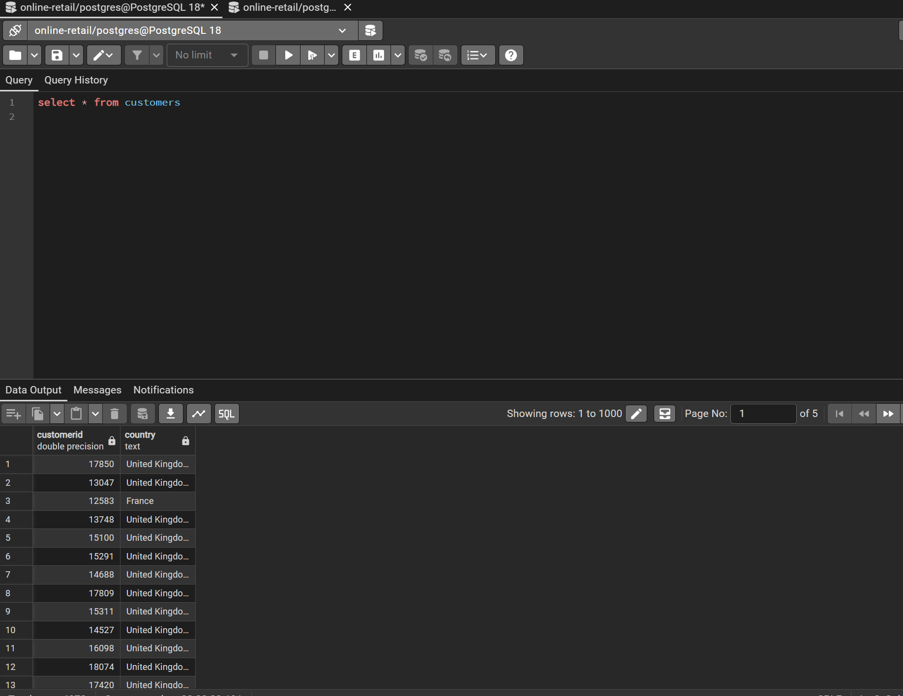
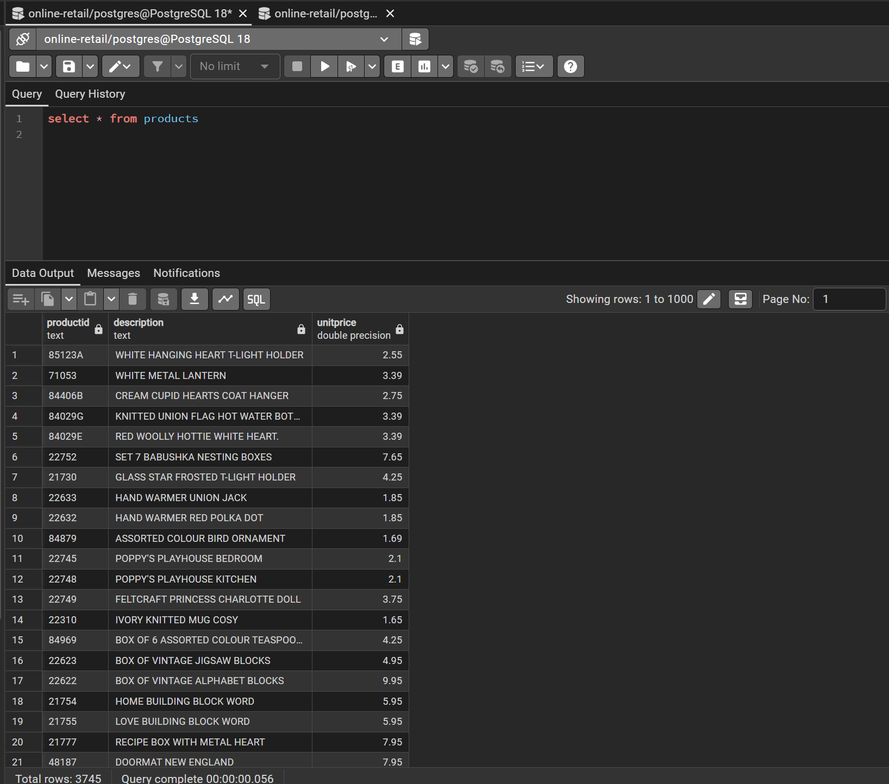
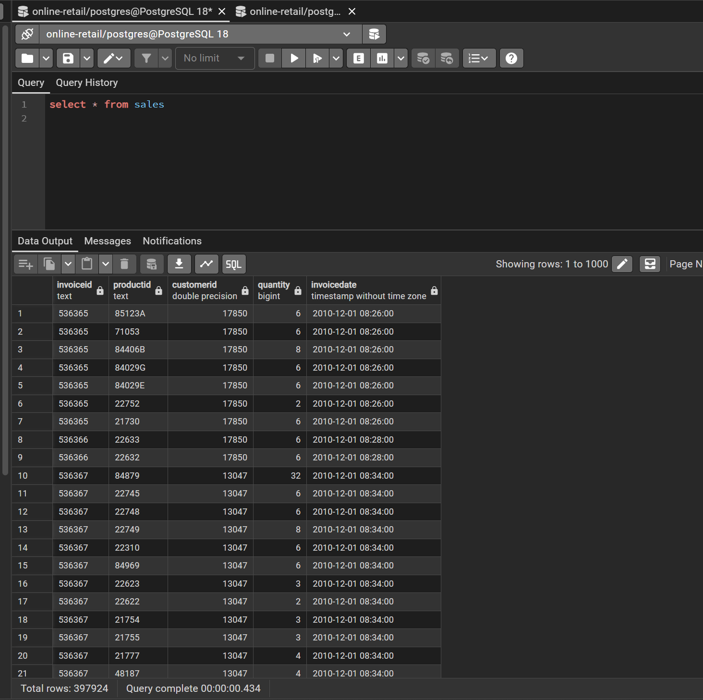
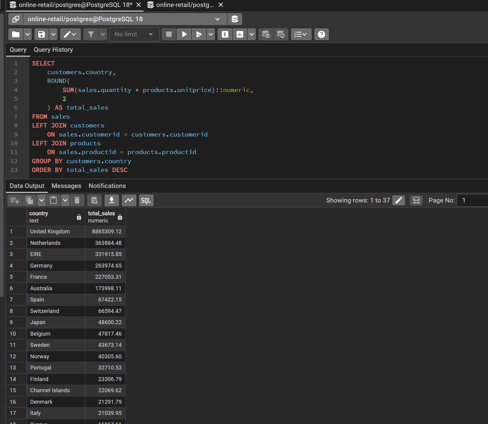
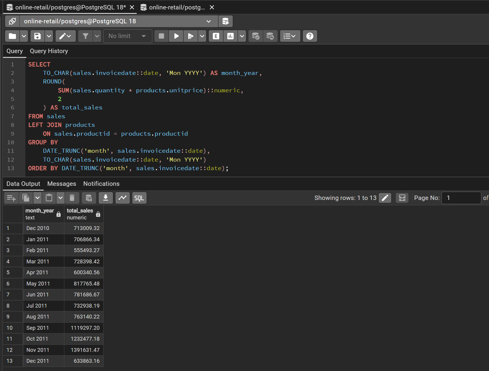
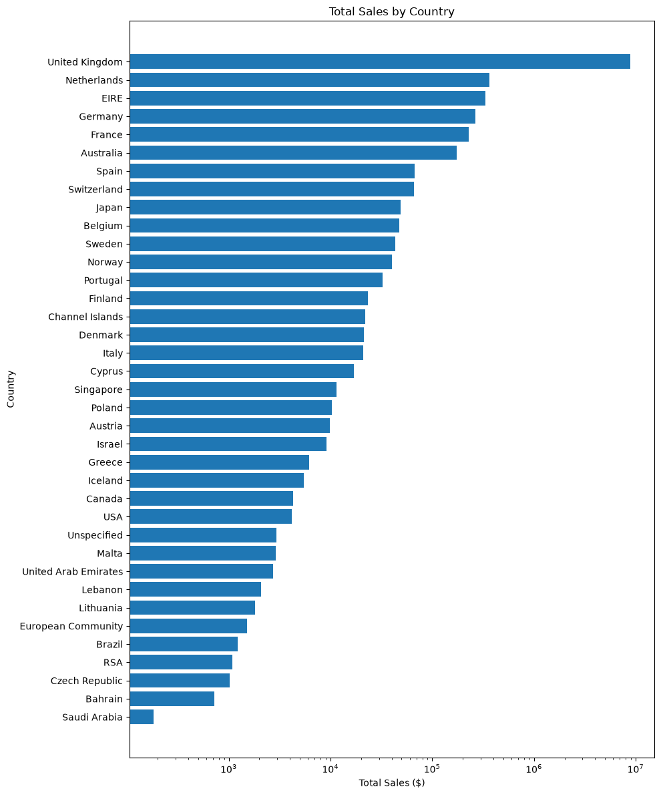
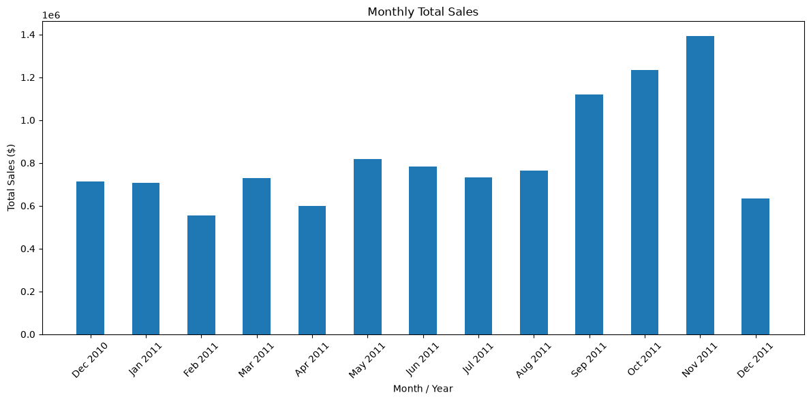

# Database Project Report

## 1. Initial Data Source

The initial dataset was obtained from https://archive.ics.uci.edu/dataset/352/online+retailin as one CSV file and consisted of three related datasets: **Customers, Products, and Sales**.

I have worked with Excel to separate the original CSV file into three separate CSV files, one for each dataset. The three resulting CSV files are:
* `customers.csv` – contains customer information such as customer ID and country.
* `products.csv` – contains product information such as product ID, description and unit price.
* `sales.csv` – contains individual sales transactions, including customerID, productID, quantity, and invoiceDate.

The three CSV files were imported into Python using pandas and then loaded into a PostgreSQL database using SQLAlchemy. The database was managed and queried using PostgreSQL and pgAdmin.

The three resulting database tables are:

* `customers` – contains customer information such as customer ID and country.
* `products` – contains product information such as product ID and unit price.
* `sales` – contains individual sales transactions, including customerID, productID, quantity, and invoiceDate.

This structure allowed the datasets to be connected through common identifiers such as `CustomerID` and `ProductID`.

---

## 2. Data Format and Size
The raw data size is

| Table     | Number of Columns | Number of Rows |
| --------- | ----------------: | -------------: |
| Customers |    2              | 4373           |
| Products  |    4              | 3958           |
| Sales     |    5              | 541909         |

After cleaning the data, using the following criteria:
* Customers - CustomerID not blank
* Products - Description not blank and UnitPrice > 0
* Sales - Quantity > 0 and CustomerID not blank

The cleaned data size is then uploaded into the database and the resulting table sizes are:

| Table     | Number of Columns | Number of Rows |
| --------- | ----------------: | -------------: |
| Customers |    2              | 4372           |
| Products  |    4              | 3745           |
| Sales     |    5              | 397924         |

---

## 3. Data Dictionary

### Customers

| Column         | Description                          | Data Type      |
| -------------- | ------------------------------------ | -------------- |
| CustomerID     | Unique identifier for each customer  | String         |
| Country        | Country associated with the customer | String         |


### Products

| Column         | Description                        | Data Type      |
| -------------- | ---------------------------------- | -------------- |
| ProductID      | Unique identifier for each product | String         |
| Description    | Description of the product         | String         |
| UnitPrice      | Price of one unit of the product   | Numeric        |


### Sales

| Column      | Description                                    | Data Type      |
| ----------- | ---------------------------------------------- | -------------- |
| InvoiceID   | Identifier for the sales invoice               | String         |
| ProductID   | Identifier of the product sold                 | String         |
| CustomerID  | Identifier of the customer making the purchase | String         |
| Quantity    | Number of units purchased                      | Integer        |
| InvoiceDate | Date of the transaction                        | Date           |

---

## 4. Data Transformation and Challenges

One of the first challenges I encountered was preparing the CSV data for PostgreSQL. The data was initially loaded into pandas DataFrames and then transferred into PostgreSQL using SQLAlchemy.

I used the following approach:

```python
customers_df.to_sql('customers', engine, if_exists='replace', index=False)
products_df.to_sql('products', engine, if_exists='replace', index=False)
sales_df.to_sql('sales', engine, if_exists='replace', index=False)
```

### Column Naming

One issue occurred because some column names contained uppercase letters, such as `CustomerID` and `ProductID`. PostgreSQL treats quoted mixed-case identifiers differently from lowercase identifiers.

For example, a query referencing:

```sql
sales.CustomerID
```

could result in an error because PostgreSQL interpreted the unquoted column name as lowercase.

I resolved this by converting the DataFrame column names to lowercase before loading the data into PostgreSQL.

```python
customers_df.columns = customers_df.columns.str.lower()
products_df.columns = products_df.columns.str.lower()
sales_df.columns = sales_df.columns.str.lower()
```

This allowed the database columns to be referenced consistently using names such as:

```sql
sales.customerid
sales.productid
sales.quantity
```

### Date Data Type

Another challenge occurred with the `InvoiceDate` column. The column was initially stored as a text value rather than a PostgreSQL date.

This caused an error when attempting to use PostgreSQL's `DATE_TRUNC()` function.

I solved the problem by explicitly converting the text value to a date:

```sql
sales.invoicedate::date
```

For example:

```sql
DATE_TRUNC('month', sales.invoicedate::date)
```

This allowed the transaction dates to be grouped by month and year.

### Calculating Sales

Another issue occurred when calculating total sales:

```sql
sales.quantity * products.unitprice
```

PostgreSQL returned a `double precision` value, while the `ROUND()` function expects a numeric value.

I resolved this by converting the calculation to `numeric`:

```sql
ROUND((sales.quantity * products.unitprice)::numeric, 2)
```

This allowed the calculated sales values to be rounded to two decimal places.

---

## 5. Table Structure and Data Types

The final PostgreSQL database contains three relational tables.

### Customers

```sql
CREATE TABLE customers (
    customerid VARCHAR,
    country VARCHAR
);
```

### Products

```sql
CREATE TABLE products (
    productid VARCHAR,
    description VARCHAR,
    unitprice NUMERIC
);
```

### Sales

```sql
CREATE TABLE sales (
    invoiceid VARCHAR,
    productid VARCHAR,
    customerid VARCHAR,
    quantity INTEGER,
    invoicedate DATE
);
```
---

## 6. Selecting Data From Each Table

### Customers

```sql
SELECT * FROM customers;
```



### Products

```sql
SELECT * FROM products;
```



### Sales

```sql
SELECT * FROM sales;
```



---

# 7. Interesting Queries

## Query 1 – Total Sales by Country

An important aggregate analysis was to determine how much revenue was generated by each country.

```sql
SELECT
    customers.country,
    ROUND(
        SUM(sales.quantity * products.unitprice)::numeric,
        2
    ) AS total_sales
FROM sales
LEFT JOIN customers
    ON sales.customerid = customers.customerid
LEFT JOIN products
    ON sales.productid = products.productid
GROUP BY customers.country
ORDER BY total_sales DESC;
```

This query demonstrates both **JOIN** and **GROUP BY with aggregation**.

The `SUM()` function calculates total sales, while `GROUP BY` separates the results by country. The results are ordered from the country with the highest sales to the lowest.



---

## Query 2 – Monthly Sales

Another interesting analysis was examining how sales changed over time.

```sql
SELECT
    TO_CHAR(sales.invoicedate::date, 'Mon YYYY') AS month_year,
    ROUND(
        SUM(sales.quantity * products.unitprice)::numeric,
        2
    ) AS total_sales
FROM sales
LEFT JOIN products
    ON sales.productid = products.productid
GROUP BY
    DATE_TRUNC('month', sales.invoicedate::date),
    TO_CHAR(sales.invoicedate::date, 'Mon YYYY')
ORDER BY DATE_TRUNC('month', sales.invoicedate::date);
```

This query groups transactions by month and calculates total sales for each month.



---

# 8. Data Visualization

The SQL results were imported into Python using pandas and visualized with Matplotlib.





---

# 9. Insights Gained

Several useful insights can be obtained from this database.

First, analyzing sales by country makes it possible to identify which markets generate the most revenue. The visualization shows that the United Kingdom is the largest market, followed by the Netherlands and Ireland. This information can help guide marketing and sales strategies.

Second, analyzing sales by month provides insight into sales trends over time. Monthly patterns can reveal periods of increased or decreased demand. We can see that sales peaked in November, likely due to holiday shopping, and were lowest in February.

Finally, combining the three tables demonstrates the value of a relational database. Instead of storing all customer, product, and transaction information in a single large table, the data is separated into logical tables and connected through identifiers. This reduces unnecessary duplication while allowing complex analytical queries to be performed.


